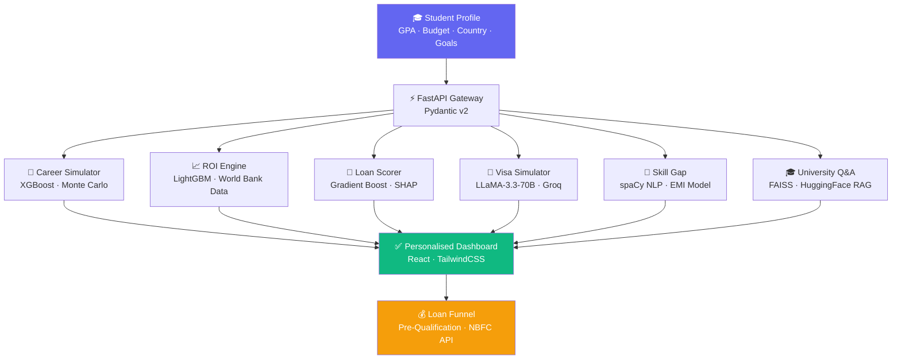
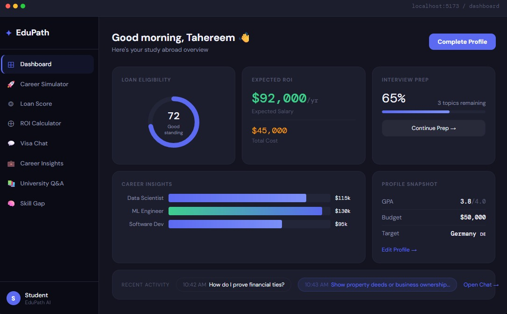

<div align="center">

# 🎓 EduPath
## *The AI Brain Behind Every Smart Study-Abroad Decision*

**Simulate careers. Score loan eligibility. Ace visa interviews. — Before students commit a single rupee.**

</div>

---

## ⚡ The Problem

> **78% unsure of career outcomes. 65% lost in the loan process. 3 in 4 overwhelmed by scattered info.**

Indian students planning higher education face **5+ disconnected decision points** — country, university, course, financing, visa — each requiring weeks of research across unconnected platforms. The result: poor choices, missed deadlines, and financial anxiety.

| | |
|---|---|
| 📊 **78%** | Unsure about career outcomes after an MS |
| 💸 **65%** | Confused about the education loan process |
| 🌍 **72%** | Unaware of their chosen degree's real ROI |
| 🗂️ **3 in 4** | Find information too scattered to act on |

---

## 💡 Solution

**EduPath** creates an **AI Digital Twin of every student's education and financial future.**

Enter your profile once. Get a full simulation — career outcomes, loan eligibility, visa readiness, and skill gaps — before making any real-world commitment.

> **LLaMA-3.3-70B** for reasoning · **XGBoost / LightGBM** for prediction · **FAISS + RAG** for personalised Q&A · **SHAP** for explainability — six AI engines, one unified platform.

---

## 🔥 Key Features

| | Feature | Outcome |
|---|---|---|
| 🤖 | **AI Career Simulator** | Compare USA, Germany & India career paths side-by-side — salary, ROI %, repayment timeline — before you commit |
| 📈 | **ROI & Salary Engine** | Predicts Year-1 & Year-5 salaries from 50K+ data points; shows exactly when the loan pays itself off |
| 🏦 | **Loan Approval Predictor** | 0–100 Profile Strength Score using university rank, career demand & salary projection — with SHAP-powered explanations |
| 🛂 | **Visa Interview Simulator** | LLM plays visa officer in a live mock interview → Visa Success % with per-dimension improvement tips |
| 📊 | **Job Market Intelligence** | Live placement probability per country, refreshed every 24 hours from real hiring data |
| 🧠 | **Skill Gap Analyser** | NLP scans job descriptions → personalised learning roadmap + EMI stress flag if repayment exceeds RBI's 35% threshold |
| 🎓 | **University Q&A** | RAG chatbot over university data — answers feel like talking to an advisor, not searching a website |

---

## 🧠 AI Architecture



**Stack:**

| Layer | Tech |
|---|---|
| Frontend | React · Vite · TailwindCSS |
| Backend | FastAPI · Uvicorn · Pydantic v2 |
| LLM | Groq · LLaMA-3.3-70B-Versatile |
| ML | XGBoost · LightGBM · Optuna · SMOTE · scikit-learn |
| NLP / RAG | spaCy · LangChain · FAISS · Sentence-Transformers |
| Explainability | SHAP |
| Data | World Bank API · ExchangeRate API |
| Cache | Redis / in-memory fallback |

---

## 🖼️ Screenshots

### 🏠 Dashboard


### 🤖 Career Simulator


### 📈 ROI Calculator


### 🏦 Loan Score


### 🏦 Loan Score & Calculation


### 🛂 Visa Chat Simulator


### 🎓 University Q&A


### 🧠 Skill Gap Analyser


### 📊 Career & Skill Gap Analyser


---

## 🚀 How It Works

```
① PROFILE   →  Student enters GPA, budget, country preference, and target field

② SIMULATE  →  Career Simulator runs ML + Monte Carlo across 3 countries
               Outputs: salary projection, ROI %, and loan repayment timeline

③ SCORE     →  Loan Engine generates a 0–100 Profile Strength Score
               Powered by: university rank + career demand + salary projection + SHAP

④ PREPARE   →  LLM visa officer conducts a mock interview
               Outputs: Visa Success % with targeted improvement tips per dimension

⑤ DECIDE    →  Skill Gap analysis + EMI Stress Index surfaces the optimal path
               Flags if repayment ratio exceeds RBI's 35% safe threshold
```

---

## 📈 Impact

<div align="center">

| Metric | Result |
|:---:|:---:|
| 🎯 Better career decisions | **+52%** |
| 🏦 Loan rejection reduction | **−28%** vs CIBIL-only scoring |
| 🛂 Visa success improvement | **+32%** vs unprepared students |
| 📊 Placement uplift | **+41%** with market-guided country selection |
| 🧠 Skill gap → placement | **+37%** with AI learning roadmaps |
| 💰 Addressable market | **$2.7 Trillion** global student loan market |

</div>

**What makes EduPath different:**

- 🔬 **Not a calculator — a Digital Twin.** Simulates the full education + career + financial arc before any real commitment
- 🏦 **NBFC-native loan scoring.** Weighs career potential, not just collateral — designed for how modern NBFCs should underwrite
- 🔍 **Explainable AI outputs.** SHAP values show *why* a score is high or low — regulator-friendly by design
- 🔄 **Built-in engagement loop.** Every tool naturally surfaces the loan funnel — zero forced conversion
- ⚡ **Production-ready, near-zero infra cost.** Groq free tier + open-source embeddings + local ML training

---

## 👥 Team Sync Up

| Member | Role |
|---|---|
| **Tahereem Khan** | AI & Backend Engineering |
| **Sharvil Titarmare** | Frontend & UX |
| **Uday Deshpande** | ML Models & Data |

---

<div align="center">

### *EduPath turns the most stressful decision of a student's life into a confident, data-backed choice.*

**Tenzor X Hackathon 2026 · AI Track · Team Sync Up**

</div>
